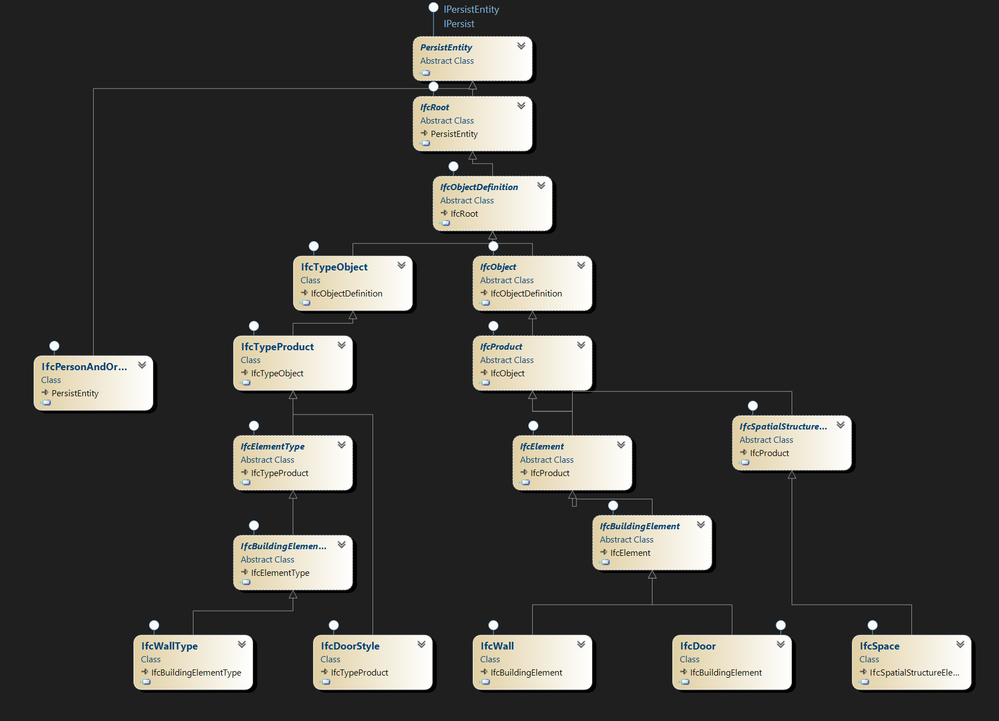
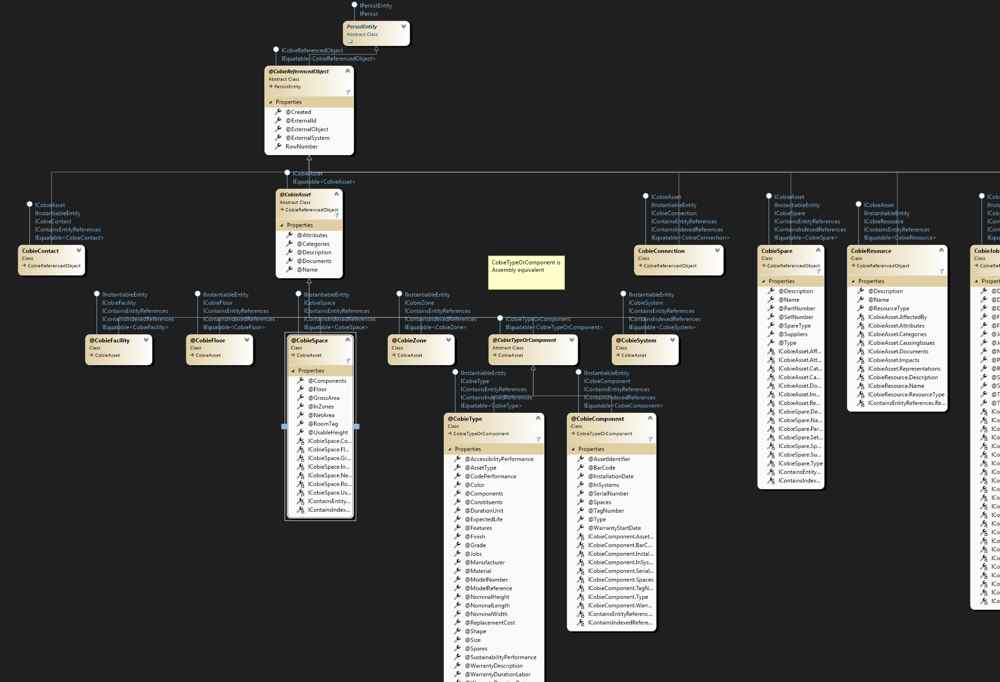
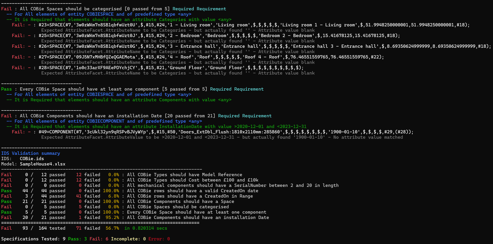

# Xbim.IDS.Validator.Extensions.COBie

_Xbim.IDS.Validator.Extensions.COBie_ is a .net (core & framework) library which extends the base xbim IDS validator to
support checking COBie models (in Microsoft Excel format, or other formats). This makes use of standard IDS schema specificiations
with the only difference being specifiers can write requirements in terms of COBie Tables (Sheets) and columns rather than 
IFC entities and attributes. This makes use of exactly the same IDS 'facets' schema but uses COBie concepts rather than IFC.

## Why use IDS to check COBie?

By re-using the existing IDS standards and conventions it's possible to define requirements and undertake QA/QC checks 
on COBie deliverables using the same concepts and technologies used to specify and verify IFC models. 
While there are other COBie validator tools available, many are challenging for a user to make use of, or tricky to customise the rules, 
so adopting IDS as a specification language for both IFC and COBie just makes a lot of sense. 

For instance it's simple using an IDS grammar to specify requirements for COBie like 'All Components must have a SerialNo attribute', 
or 'All Spaces should contain Components'. 
With IDS's built in support for complex constraints it's also easy to add specific information requirements to enforce naming conventions,
range checks on values such as WarranteeDurations etc.

## How does this work?

### Some background

The xbim Core IDS implementation is built around xbim's `IModel` which abstracts the specific schema implementations of model being tested.
The specific instance (elements) in a model are all self-describing based on their underlying EXPRESS metadata.
That means IModels can work IFC2x3, IFC4, IFC4.3 schemas, or a future IFC standard in a way that is plugable - it just needs an xbim Express
IModel implementation. 

### COBie as an IModel

[XbimCobieExpress](https://github.com/xBimTeam/XbimCobieExpress) is an implementation of **COBie** from an Express
schema, with full support for reading and writing Excel COBie data from Excel an other formats. 
Its schema is essentially COBie, where each entity type corresponds to a table in COBie. 

So rather than an IFC schema like:



... we're simply working with a COBie equivalent:



... which is hopefully recognisable as a data model based on the COBie 2.4 data model. Note the introduction of a number
of base classes such as `CobieAsset` and `CobieReferencedObject` which help provide a common set of behaviours across sheets.

Ultimately, in place of a IDS facet specifying an IFC entity type such as IFCDOOR, or IFCSPACE, in COBie we can specify in terms of a COBIECOMPONENTS or COBIESPACE and their Attributes, Properties, Classifications etc.

## Which IDS Facet Types work with COBie?

Currently only Entity Type (Sheet), Attribute (Column) and Properties (Attributes sheet) are supported - however this alone gives access to the whole COBie domain. Other
facets such as Classification can be expressed in terms of these two facets, and will be introduced in a future update for 
completeness.

| IDS Facet | COBie Equivalent |
| --------- | ---------------- |
| Entity Type | Cobie Table      |
| Attribute | Cobie Field/Column |
| Property | *WIP:** Mapped to COBie Attributes sheet |
| Classification | **TO DO:** Mapped through to Cobie Category |
| Part Of | **TO DO:** Mapped Assemblies / Spatial tables |
| Material | Not supported? |

## How does an IDS specification look?

Just like a typical IDS spec. A typical example using COBie:
```xml
<?xml version="1.0" encoding="utf-8"?>
<ids xsi:schemaLocation="http://standards.buildingsmart.org/IDS http://standards.buildingsmart.org/IDS/0.9.7/ids.xsd" xmlns="http://standards.buildingsmart.org/IDS" xmlns:xs="http://www.w3.org/2001/XMLSchema" xmlns:xsi="http://www.w3.org/2001/XMLSchema-instance">
  <info>
    <title>Components have valid installation date</title>
  </info>
  <specifications>
    <specification name="All components should have a InstallationDate after Dec 2023" ifcVersion="COBIE2.4">
      <applicability minOccurs="1" maxOccurs="unbounded">
        <entity>
          <name>
            <simpleValue>COBIECOMPONENT</simpleValue>
          </name>
        </entity>
      </applicability>
      <requirements>
        <attribute cardinality="required">
          <name>
            <simpleValue>InstallationDate</simpleValue>
          </name>
          <value>
            <xs:restriction base="xs:string">
              <xs:minExclusive value="2023-12-01" fixed="false" />
            </xs:restriction>
          </value>
        </attribute>
      </requirements>
    </specification>
  </specifications>
</ids>
```

Note: while this is completely valid IDS according to the latest IDS XSD schema, the file will raise warnings in an IDS Audit
since the IfcVersion 'COBIE2.4' is unsupported and 'COBIECOMPONENT' is not a recognised IFC type, so you may see 'Content Warnings'.
The implementation of this feature is proprietary to xbim, so the file is unlikely to be supported by other software implementations,
where 'COBIE2.4' will not be recognised.

## How do I use it?

A fully functional Console application is included in this repo in the __Xbim.IDS.Validator.Console__ project that 
can operate on COBie inputs.

```
Xbim.IDS.Validator.Console.exe --ids cobie.ids -m CobieSheet.xlsx
```



## How do I install this addon?

```
dotnet add package Xbim.IDS.Validator.Core.Extensions.COBie
```

... which will include the Core IDS validator as a dependency.


### Integrating with your software services

Given an IDS file such as [example.ids](../Xbim.IDS.Validator.Extensions.COBie.Tests/TestModels/Cobie.ids) and an input COBie Excel file such as 
[SampleHouse4.xlsx](../Xbim.IDS.Validator.Extensions.COBie.Tests/TestModels/SampleHouse4.xlsx), a basic implementation might look like:


```csharp

// during application startup/bootstrap:

IServiceCollection serviceCollection = new ServiceCollection();

serviceCollection.AddIdsValidation(cfg =>
    cfg.AddCOBie()  // < === Adds COBie conventions
);

// Build service provider if not using DI 
var provider = serviceCollection.BuildServiceProvider();

// Get IdsModelValidator from an IServiceProvider / or inject to your service
var idsValidator = provider.GetRequiredService<IIdsModelValidator>();

// Open a model

IModel model = OpenCOBie("SampleFile.xlsx"); 

// optionally you can over-ride some behaviours
var options = new VerificationOptions
{
    OutputFullEntity = true,            // Returns the full COBie entity in results, not just key
    PerformInPlaceSchemaUpgrade = true, // Update old IDS schemas to latest version
    PermittedIdsAuditStatuses = VerificationOptions.Relaxed,    // Silently ignore some IDS schema errors - just log the fault
    AllowDerivedAttributes = true,   // Allow Derived attributes to be tested - IMPORTANT for COBie navigation between tables
    
};

// Invoke the validation checking asynchronously. Also supports cancellation and async progress updating.
ValidationOutcome outcome = await idsValidator.ValidateAgainstIdsAsync(model, "example.ids", logger, verificationOptions: options);

// Present the results
foreach (ValidationRequirement requirement in outcome.ExecutedRequirements)
{
    // ApplicableResults contains details of the applicable COBie entities (rows) tested
    var entitiesTested = requirement.ApplicableResults.Count();
    var entitiesPassed = requirement.ApplicableResults.Count(e => e.ValidationStatus == ValidationStatus.Pass);
    Console.WriteLine("[{0,-8}] : [{1}/{2}] met {3} specification '{4}' ",
        requirement.Status,
        entitiesPassed, entitiesTested,
        requirement.Specification.Cardinality.Description,
        requirement.Specification.Name
        );

    // Detail the failure reasons against applicable entities.

    foreach(var entity in requirement.ApplicableResults.Where(e => e.ValidationStatus != ValidationStatus.Pass))
    {
        Console.WriteLine(" Failed COBie Entity: {0}", entity.FullEntity);
        foreach(var failure in entity.Messages)
        {
            // Reasons for failure
            Console.WriteLine("   {0}", failure);
        }
    }
}

 static IModel OpenCOBie(string cobieFile)
 {
     var mapping = Xbim.IO.CobieExpress.CobieModel.GetMapping();
     // Optionally control the tables imported
     // mapping.ClassMappings.RemoveAll(m => m.Class.StartsWith("Attribute"));
     var model = Xbim.IO.CobieExpress.CobieModel.ImportFromTable(cobieFile, out string report, mapping);

     return model;
 }
```


## How much of the IDS spec does this support?

This is experimental addon module. It currently support just two of the six IDS facets:

- [x] IFC Entity Type (Cobie Sheet/Table)
- [x] Attribute (COBie column)
- [x] Properties - Permits verification against Attributes relating to a COBie entity (COBieAsset)
- [ ] Classification - TODO map to Category
- [ ] PartOf - TODO handle Assemblies, Spatial etc
- [ ] Material - n/a : Not part of COBie?

## To-do list

- [ ] CObie support Pset, Classification and PartOf Facets
- [ ] Consider supporting IfcEntity Type (via ExternalObjectType)
- [ ] Review possibility of uniqueness checks/aggregates
- [ ] Review with IDS team if this extension has merit for standardising

## Contributing

Feedback welcome. For issues please raise an Issue in the [Xbim.IDS.Validator](https://github.com/xBimTeam/Xbim.IDS.Validator) Github project

## License
This library is made available by xbim Ltd under the GNU Affero General Public License v3. **Please note** this is different to the Open Source license used by other 
libraries in the xbim Toolkit (CDDL), and means that, while you are free to use this software for evaluation, personal, and non-commercial use, it is not compatible for use
use in 'proprietary' (closed-source) commercial software. 

__If you are a developer wishing to use this library in commercial software please contact sales@xbim.net to discuss a commercial license, or contact @andyward on github.__
